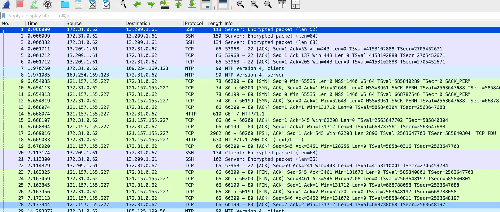

TCP Keepalive는 두 종단 간 맺은 세션을 유지해서 통신이 일어날 때마다 유지 중인 세션을 이용하게 한다.

# 8.1 TCP Keepalive란

TCP Keepalive는 무엇을 의미하는 것일까? TCP 통신을 위해서는 3-way handshake가 필요하다. 이는 TCP 통신을 위해 반드시 지켜야 하는 표준 규약이며 회피할 수 있는 방법은 없다. 하지만 두 종단 간의 통신이 필요할 때마다 3-way handshake를 진행한다면, 통신량이 많고 지속적인 경우에는 상당히 불편할 것이다. 통신이 지속적으로 이루어진다면 **처음 만들어놓은 세션을 없애지 않고 계속 사용할 수는 없을까? 이런 생각에서 출발한 것이 바로 TCP Keepalive이다.**

그림 8-1을 보면 TCP Keepalive는 일정 시간이 지나면 연결된 세션의 두 종단이 서로 살아 있는지를 확인하는 아주 작은 양의 패킷을 하나 보낸다. 양쪽 모두에서 이 패킷을 보낼 필요는 없다. 연결을 유지하는게 유리한 쪽에서만 진행해도 된다. 즉, 클라이언트 혹은 서버 둘 중에 하나라도 이 기능을 사용한다면 세션은 유지된다.

서로 Keepalive 확인을 위한 작은 패킷을 주고 받은 후에 타이머는 다시 원래 값으로 돌아가고 카운트를 진행한다. 이런 방식으로 주기적으로 두 종단 간에 Keepalive를 확인하면서 양쪽의 세션이 끊기지않고 유지된다.

현재 사용하고 있는 네트워크 소켓이 Keepalive를 지원하고 있는지 확인할 수 있는 방법은 무엇일까? `netstat` 명령을 사용하면 된다.

```yaml
root@ip-172-31-0-19:/home/ubuntu# netstat -napo
Active Internet connections (servers and established)
Proto Recv-Q Send-Q Local Address           Foreign Address         State       PID/Program name     Timer
tcp        0      0 0.0.0.0:22              0.0.0.0:*               LISTEN      1036/sshd: /usr/sbi  off (0.00/0/0)
tcp        0      0 127.0.0.53:53           0.0.0.0:*               LISTEN      324/systemd-resolve  off (0.00/0/0)
tcp        0      0 172.31.0.19:34904       13.124.245.230:80       TIME_WAIT   -                    timewait (28.13/0/0)
tcp        0    393 172.31.0.19:48242       54.171.230.55:443       ESTABLISHED 1624/https           on (1.37/1/0)
tcp        0    284 172.31.0.19:22          13.209.1.61:54827       ESTABLISHED 1082/sshd: ubuntu [  on (0.00/0/0)
tcp        0      0 172.31.0.19:58520       91.189.91.83:80         TIME_WAIT   -                    timewait (28.32/0/0)
tcp        0      0 172.31.0.19:40200       52.79.128.16:80         TIME_WAIT   -                    timewait (48.42/0/0)
tcp6       0      0 :::22                   :::*                    LISTEN      1036/sshd: /usr/sbi  off (0.00/0/0)
udp        0      0 127.0.0.1:323           0.0.0.0:*                           394/chronyd          off (0.00/0/0)
udp        0      0 127.0.0.53:53           0.0.0.0:*                           324/systemd-resolve  off (0.00/0/0)
udp        0      0 172.31.0.19:68          0.0.0.0:*                           322/systemd-network  off (0.00/0/0)
```

제일 마지막 열에 있는 Timer 항목을 통해서 현재 소켓에 설정된 타이머 값을 볼 수 있다. 여기에서 확인할 수 있는 소켓의 타이머에는 TIME_WAIT 타이머, FIN_WAIT 타이머 등이 있으며 연결된 ESTABLISHED 상태의 소켓에서는 Keepalive 타이머를 확인할 수 있다.  1을 보면 sshd 데몬이 사용하는 소켓에 keepalive 옵션이 켜져 있고 타이머가 70초 가량 남아있다. 해당 타이머의 시간이 다 되면 연결이 살아있는지를 확인하는 작은 패킷을 하나 보낸다.

그럼 TCP Keepalive를 어떻게 사용할 수 있을까? 소켓을 생성할 때 소켓 옵션을 설정하면 된다. 소켓 옵션은 `setsockopt()` 라는 함수를 통해서 설정하는데, 함수의 옵션 중에 `SO_KEEPALIVE`를 선택하면 TCP Keepalive를 사용할 수 있다. 하지만 C 언어를 통해서 직접 클라이언트와 서버를 구현하는 경우가 아니라면 보통 이런 방식을 사용하지는 않는다. 그래서 대부분의 애플리케이션에는 TCP Keepalive를 설정할 수 있는 별도의 옵션을 제공한다.

TCP Keepalive의 패킷은 68바이트정도로 매우 작은 크기이기 때문에 종단 간의 세션 유지를 위해 많은 리소스가 필요치 않아서 가능하면 켜져 있는 상태로 통신을 하는 것이 좋다.

# 8.2 TCP Keepalive의 파라미터들

```yaml
root@ip-172-31-0-19:/home/ubuntu# sysctl -a | grep -i keepalive
net.ipv4.tcp_keepalive_intvl = 75    // 3
net.ipv4.tcp_keepalive_probes = 9    // 2
net.ipv4.tcp_keepalive_time = 7200   // 1
```

## net.ipv4.tcp_keepalive_time

이름이 의미하는 것처럼 keepalive 소켓의 유지 시간을 의미한다. 위 결과에서는 TCP Keepalive 옵션이 적용된 상태의 소켓은 7200초 연결을 유지한다. 타이머는 이 시간을 기준으로 동작하며, 이 시간이 지나면 keepalive 확인 패킷을 보낸다. 이 값은 직접 지정할 수 있으며, 지정하지 않았을 경우에만 커널 파라미터의 값으로 적용된다.

## net.ipv4.tcp_keepalive_probes

keepalive 패킷을 보낼 최대 전송 횟수를 정의한다. keepalive 패킷에 한번 응답하지 않았다고 해서 바로 연결을 끊을 수는 없다. 네트워크 패킷은 다양한 원인으로 손실될 수 있으며 이에 따른 재전송 메커니즘이 있다. 하지만 무한정 보낼 수는 없기 때문에 이 파라미터를 통해서 최대 재전송 횟수를 정의한다. 위 결과에서는 9로 설정했기 때문에 최초의 keepalive 패킷을 포함해서 총 9번의 패킷을 보내고 그 후에도 응답이 없으면 연결을 끊는다.

## net.ipv4.tcp_keepalive_intvl

keepalive 재전송 패킷을 보내는 주기를 의미한다. keepalive 확인 패킷에 응답이 없으면 몇 초 후에 재전송 패킷을 보낼 것인지 그 값을 정의한다.

최초 `tco_keepalive_time` 초 동안 기다린 후 keepalive 확인 패킷을 보내고, 최초 패킷에 대한 응답이 오지 않으면 `tcp_keepalive_intvl` 간격으로 `tcp_keepalive_probes` 번의 패킷을 더 보낸다. 그 후에도 응답이 오지 않으면 연결을 끊는다. 이런 설정은 어떤 경우에 도움이 될까?

두 종단 간의 연결을 끊기 위해서는 FIN 패킷이 필요하다. 양쪽 모두 정상적으로 FIN을 주고받아서 연결을 끊는 것이 정상적인 상황이지만, 시스템을 운영하다 보면 다양한 이슈로 인해 FIN을 주고받지 못하고 끊어지는 경우가 생긴다. 예를 들어 서버가 연결되어 있는 스위치에 장애가 발생하면 두 종단 간 연결이 끊어지지만, FIN을 전달할 방법이 없어서 계속해서 연결된 것처럼 남아있게 된다. 하지만 TCP Keepalive 옵션을 사용한다면 일정 시간이 지난 후에 keepalive 확인 패킷을 보내고, 이에 대한 응답이 없다면 커널이 끊어진 세션으로 판단하고 소켓을 정리한다.

# 8.3 TCP Keepalive와 좀비 커넥션

TCP Keepalive는 커널 레벨에서 두 종단 간의 연결을 유지하는 기능이며, 이를 통해서 불필요한 TCP Handshake를 줄일 수 있어 전체적으로 서비스의 품질을 높일 수 있다. 하지만 가장 큰 효과를 볼 수 있는 부분은 잘못된 커넥션 유지, 흔히 좀비 커넥션이라고 부르는 소켓을 방지하는 기능이다.

# 8.4 TCP Keepalive와 HTTP Keepalive

아파치, nginx 같은 웹 애플리케이션에도 keepalive timeout이라는 것이 존재한다. HTTP/1.1에서 지원하는 keepalive를 위한 설정 항목이다. **TCP Keepalive는 두 종단 간의 연결을 유지하기 위함이지만, HTTP Keepalive는 최대한 연결을 유지하는 것이 목적이다.** 만약 두 값 모두 60초라고 한다면 TCP Keepalive는 60초 간격으로 연결이 유지되었는지를 확인하고, 응답을 받았다면 계속해서 연결을 유지한다. 하지만 애플리케이션에서는 60초 동안 유지하고, 60초가 지난 후에도 요청이 없다면 연결을 끊는다.

가장 혼동하기 쉬운 부분은 두 값이 서로 다를 때 소켓이 어떻게 관리되는지인데, 간단한 테스트를 통해서 확인해보자.

```yaml
root@ip-172-31-0-62:/home/ubuntu# sysctl -w net.ipv4.tcp_keepalive_time=30
net.ipv4.tcp_keepalive_time = 30
root@ip-172-31-0-62:/home/ubuntu# cat /etc/apache2/apache2.conf | grep -i keepalive
# KeepAlive: Whether or not to allow persistent connections (more than
KeepAlive On
# MaxKeepAliveRequests: The maximum number of requests to allow
MaxKeepAliveRequests 100
# KeepAliveTimeout: Number of seconds to wait for the next request from the
KeepAliveTimeout 5
root@ip-172-31-0-62:/ho
```

```yaml
root@ip-172-31-0-19:/home/ubuntu# telnet 3.36.54.48 80
Trying 3.36.54.48...
Connected to 3.36.54.48.
Escape character is '^]'.
GET / HTTP/1.1
HTTP/1.1 408 Request Timeout
Date: Wed, 11 Feb 2026 02:30:29 GMT
Server: Apache/2.4.58 (Ubuntu)
Content-Length: 333
Connection: close
Content-Type: text/html; charset=iso-8859-1

<!DOCTYPE HTML PUBLIC "-//IETF//DTD HTML 2.0//EN">
<html><head>
<title>408 Request Timeout</title>
</head><body>
<h1>Request Timeout</h1>
<p>Server timeout waiting for the HTTP request from the client.</p>
<hr>
<address>Apache/2.4.58 (Ubuntu) Server at ip-172-31-0-62.ap-northeast-2.compute.internal Port 80</address>
</body></html>
Connection closed by foreign host.
```

```yaml
root@ip-172-31-0-62:/home/ubuntu# netstat -napo | grep :80
tcp6       0      0 :::80                   :::*                    LISTEN      2460/apache2         off (0.00/0/0)
tcp6       0      0 172.31.0.62:80          15.164.71.151:58544     SYN_RECV    -                    on (1.23/4/0)
root@ip-172-31-0-62:/home/ubuntu# netstat -napo | grep :80
tcp6       0      0 :::80                   :::*                    LISTEN      2460/apache2         off (0.00/0/0)
tcp6       0      0 172.31.0.62:80          15.164.71.151:58544     ESTABLISHED 2463/apache2         keepalive (29.29/0/0)
root@ip-172-31-0-62:/home/ubuntu# netstat -napo | grep :80
tcp6       0      0 :::80                   :::*                    LISTEN      2460/apache2         off (0.00/0/0)
tcp6       0      0 172.31.0.62:80          15.164.71.151:58544     ESTABLISHED 2463/apache2         keepalive (28.53/0/0)
root@ip-172-31-0-62:/home/ubuntu# netstat -napo | grep :80
tcp6       0      0 :::80                   :::*                    LISTEN      2460/apache2         off (0.00/0/0)
tcp6       0      0 172.31.0.62:80          15.164.71.151:58544     TIME_WAIT   -                    timewait (40.17/0/0)
root@ip-172-31-0-62:/home/ubuntu# netstat -napo | grep :80
tcp6       0      0 :::80                   :::*                    LISTEN      2460/apache2         off (0.00/0/0)
tcp6       0      0 172.31.0.62:80          15.164.71.151:58544     TIME_WAIT   -                    timewait (39.51/0/0)
root@ip-172-31-0-62:/home/ubuntu# netstat -napo | grep :80
tcp6       0      0 :::80                   :::*                    LISTEN      2460/apache2         off (0.00/0/0)
tcp6       0      0 172.31.0.62:80          121.157.155.227:60065   ESTABLISHED 2464/apache2         keepalive (26.95/0/0)
tcp6       0      0 172.31.0.62:80          121.157.155.227:60064   SYN_RECV    -                    on (0.00/1/0)
tcp6       0      0 172.31.0.62:80          15.164.71.151:58544     TIME_WAIT   -                    timewait (26.94/0/0)
root@ip-172-31-0-62:/home/ubuntu# netstat -napo | grep :80
tcp6       0      0 :::80                   :::*                    LISTEN      2460/apache2         off (0.00/0/0)
tcp6       0      0 172.31.0.62:80          121.157.155.227:60065   ESTABLISHED 2464/apache2         keepalive (25.77/0/0)
tcp6       0      0 172.31.0.62:80          121.157.155.227:60064   SYN_RECV    -                    on (2.85/2/0)
tcp6       0      0 172.31.0.62:80          15.164.71.151:58544     TIME_WAIT   -                    timewait (25.76/0/0)
```

한 가지 재밌는 것은 Apache는 SO_KEEPALLIVE 옵션을 켠 상태로 소켓이 바인딩된다는 점이다. 뒤에 keepalive timer가 보이는 것을 통해 알 수 있다. `netstat` 명령으로 확인해보면 계속해서 타이머가 줄어든다. 그리고 30초가 지나면 다시 keepalive 타이머가 30초부터 시작해서 동작한다. 마지막으로 2번째 타이머까지 모두 종료가 되는 시점, 즉 60초가 다 되면 Apache Keepalive Timeout에 의해 서버가 먼저 클라이언트와 연결을 종료한다. 이는 클라이언트의 메시지를 통해서 확인할 수 있다.



나는 Keepalive 패킷이 안 잡힌다..